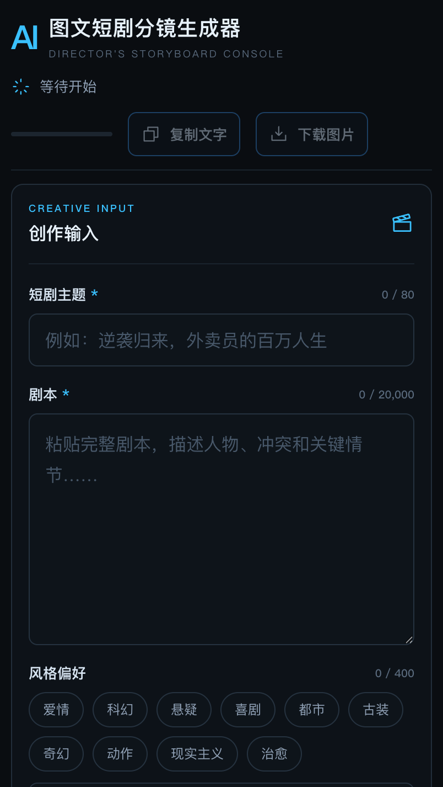

[简体中文](./README.md) | English

# AI Storyboard Studio (AI 图文短剧分镜生成器)

A text-plus-image storyboard workbench for short-video creators. The server first calls Alibaba Cloud Model Studio (Bailian) `qwen3.7-plus` and displays the 5 text shots one by one as they stream in; it then automatically calls `qwen-image-2.0-pro-2026-06-22` to generate one 16:9 landscape image for each shot.

Live site: <https://ai-storyboard-studio-zeta.vercel.app>



## Usage (bring your own key)

1. Open the live site.
2. Paste your own Beijing-region API key into the「百炼 API Key」(Bailian API Key) field and click「保存」(Save).
3. Enter your short-drama theme and script, then click generate.

This key is stored only in your browser's `localStorage` and is sent to the server through the
`x-dashscope-api-key` request header with every request. The server uses it only within that single
request: it is never written to disk, never logged, and never echoed back in any response.
**All costs are billed directly to your own Bailian account; this site holds no keys and cannot pay on your behalf.**

To remove the key: click「清除」(Clear) in the same section.

## Local development

```bash
npm install
npm run dev
```

Locally you can also fall back to an environment variable (handy for debugging without a browser key): copy `.env.example` to `.env` and set `DASHSCOPE_API_KEY`; the request header can then be omitted. `.env` is listed in `.gitignore` — do not commit it.

Optional environment variables:

- `DASHSCOPE_BASE_URL`: defaults to the shared Beijing-region endpoint.
- `DASHSCOPE_MODEL`: defaults to `qwen3.7-plus`.
- `DASHSCOPE_IMAGE_ENDPOINT` / `DASHSCOPE_IMAGE_MODEL` / `DASHSCOPE_IMAGE_SIZE`:
  image-model endpoint, model, and size; default `2688*1536` (16:9 landscape).

The image model is billed per image; by default one run generates 5 images, and the page queues
them one at a time within the 2 RPM limit. Bailian image links expire after roughly 24 hours, so
download them within the current session.

## Deployment

Vercel (project `ai-storyboard-studio`, auto-built on every push to `main`):

- Frontend: `npm run build` outputs `dist/client`
- API: `api/storyboards.js` Node function, reusing `server/storyboards.js`
- Configuration: `vercel.json`

`worker/`, `scripts/prepare-sites-build.mjs`, and `.openai/hosting.json` are leftovers from the old
ChatGPT Sites channel; they are not part of the default build. When needed, verify them separately
with `npm run build:sites && npm run test:sites`.

## Verification

```bash
npm run build
npm test
```

17 tests cover input validation, streaming NDJSON parsing, image prompts and native API parameters,
download signing, tamper checks, copy formatting, the BYOK request-header path (including an
assertion that the key is never echoed back), and local key storage.
